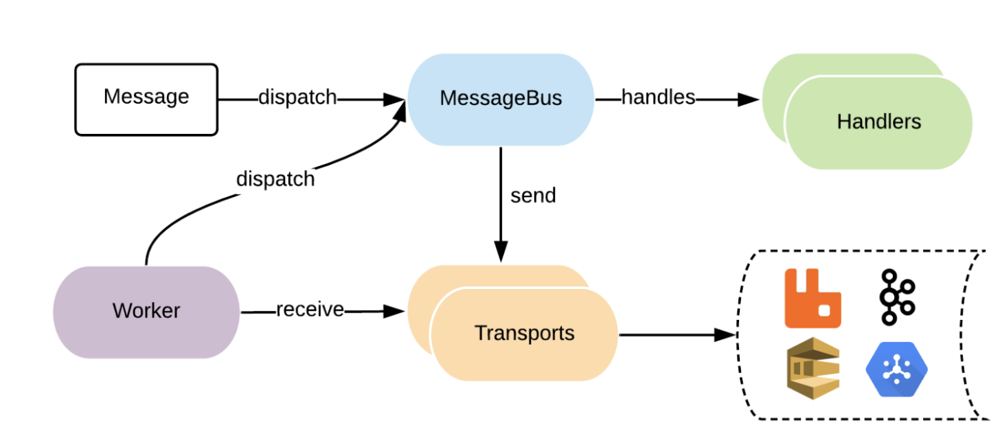

autoscale: true
header: #6B62C4, alignment(left)
text: #555555
background-color: #FFFFFF
footer: Symfony Xmas Meetup - December 2018
slidenumbers: true

# [fit] Integrate your Symfony application with your Cloud Infrastructure using the Symfony Messenger

---

# About me 👨‍💻

- French engineering student
- Technical manager @ Junior ISEP
- Intern Full Stack Software engineer @ Birdie
- Passionate about web, mobile and more!

---

# The challenge

- PHP is a synchronous language
- It's difficult to execute things outside of a request / response context
- Slow running processes directly affect user experience

---

# The challenge

- Call to a 3rd party API
- Big processing after a user interaction
- Sending an email or an SMS
- ...

---

# Quick example

---

# A solution: Asynchronous operations
Aka postponing **("I'll just do it later 🤷‍♂️")**

---

# Quick questions

[.build-lists]
- Who has worked with IaaS before?
  (AWS, GCP, Azure, Heroku, ...)
- Who has heard of the Symfony Messenger?
- Who has worked with the Symfony Messenger?
  (side project or production)

---

# Recap on the Symfony Messenger

---

# It's (small) demo time!

---

# Recap

- Receive an API call
- Send an message through the Symfony Messenger to RabbitMQ
- Respond **now** to the client
- Handle the message later (either with the console or with another service)

---

# The benefits

- Separate the work between different components / services of your application
- Multiple languages in your project
- Asynchronous operations for heavy duty (or long-running processes)

---

# Thanks!
## Questions?